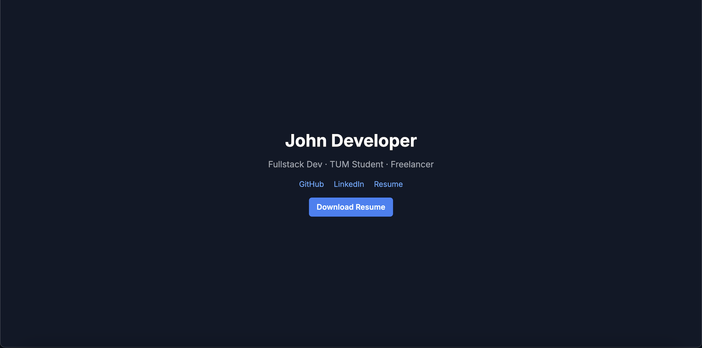

# Dark Portfolio – Developer Edition

A sleek, modern developer portfolio template built with **Tailwind CSS**.  
Perfect for showcasing your skills, resume, and featured projects in a minimalist dark/light theme.

---

## 💡 Features

- 🌗 Dark/Light mode toggle  
- 📄 Downloadable resume button  
- 🖼️ Project showcase grid (3 slots)  
- 📱 Responsive design for all screen sizes  
- 🎯 Clean, minimal layout with Tailwind CSS  
- ⚡ Fast and lightweight  

---

## Live Demo
Check out the live demo here: [https://dark-portfolio-dev.netlify.app/](https://dark-portfolio-dev.netlify.app/)

---

## 📸 Preview



---

## 📁 Files Included

- `index.html` – the main HTML file  
- `style.css` – Tailwind styles and animations  
- `preview.png` – thumbnail for GitHub and Gumroad  
- `README.md` – this file  
- `assets/` – optional folder for custom images or files  

---

## 🚀 How to Use

1. **Download or clone the repo:**

   ```bash
   git clone https://github.com/nefju1/dark-portfolio-dev.git
   cd dark-portfolio-dev
   ```

2. **Open index.html directly in your browser — no build steps required.**

3. **Customize:**

- Your name and bio
- Resume link
- Project links
- Social/contact info in the footer

🧠 **License**
Free for personal and commercial use.
Attribution appreciated but not required.

